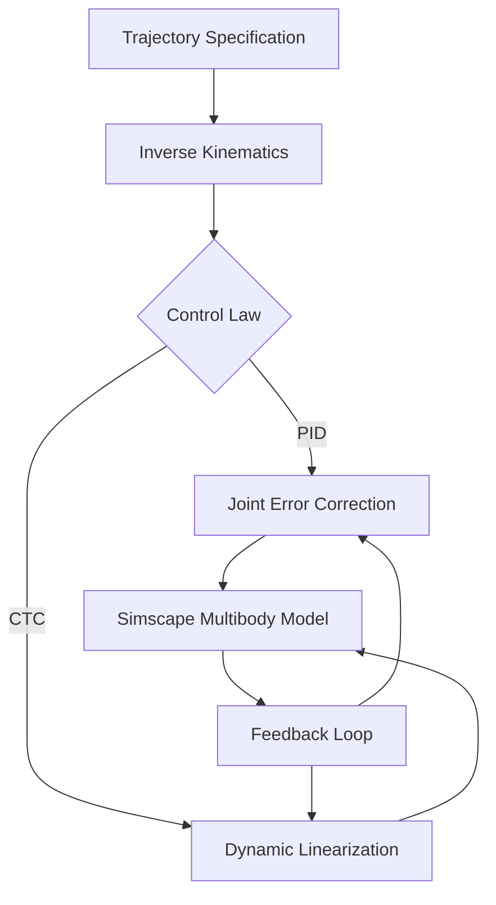

# 🏗️ 2-DOF Robot Manipulator Control & Simulation
### Comparative Analysis of PID vs. Computed Torque Control in Simscape

This project focuses on the modeling, simulation, and control of a 2-degree-of-freedom (2-DOF) robotic manipulator. It provides a comprehensive comparison between classical **PID control** and advanced **Computed Torque Control (CTC)**, validated through both mathematical dynamic models and Simscape Multibody physics simulations.

---

## 📈 Control Performance

- **PID Control:** Robust trajectory tracking with optimized gains for various load conditions.
- **Computed Torque Control:** Linearizing control law that cancels non-linear dynamics (gravity, Coriolis, inertia), achieving superior tracking precision.
- **Dynamic Modeling:** Detailed derivation of Euler-Lagrange equations for the 2-link system.
- **Comparison:** Empirical analysis of response time, steady-state error, and stability under varying disturbances.

---

## 🏗️ System Overview

---

## 🛠️ Installation & Usage

### Requirements
- MATLAB R2022b or later
- Simulink
- Simscape Multibody Toolbox
- Control System Toolbox

### How to Run
1. Clone the repository: `git clone https://github.com/Docprox-pixel/2DOF-Robot-Manipulator-Control-Simulation.git`
2. Open `manipulator_main.m` in MATLAB.
3. Run the script to initialize parameters.
4. Open the Simulink model `manipulator_sim.slx` and click **Run**.
5. Use the `plot_results.m` script to visualize the comparison between PID and CTC performance.

---

## 📄 License
This project is licensed under the Apache License 2.0 - see the [LICENSE](LICENSE) file for details.

---
*Developed by [Aryan Yadav](https://www.linkedin.com/in/aryan-yadav-1858632b5)*
